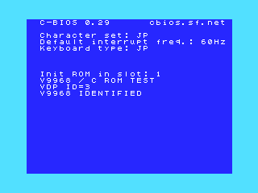

[日本語](README.ja.md) | English

# openmsx-v9968-windows-setup

Unofficial Windows setup helpers for the V9968-enabled openMSX fork. Version **0.5.0**. This is an independent helper project, not the official openMSX or V9968 project.

V9968 is an MSX video display processor (VDP). The fork emulates it in place of a machine's built-in VDP. These helpers build a ready-to-run environment for it: they download tested emulator versions, verify hashes, and run a V9968 identification test.

## Which setup to choose

| | C-BIOS | FS-A1GT |
|---|---|---|
| What you need first | Nothing; everything is downloaded | Two ROM images dumped from your own FS-A1GT ([how to dump](docs/bios-dump.md)) |
| What you can run | Cartridge images | A machine environment with BASIC and disk |
| Time | A few minutes | Plan for the dump first |

## Quick start

1. Download `openmsx-v9968-windows-setup-0.5.0.zip` from **Assets** on [GitHub Releases](https://github.com/renatus-xxxx/openmsx-v9968-windows-setup/releases). Extract the **whole ZIP** into a new writable folder. Do not run BAT files inside a ZIP viewer.
2. Run `setup-cbios-v9968.bat`, or drag your FS-A1GT BIOS folder onto `setup-fsa1gt-v9968.bat`.
3. Run `launch-cbios-v9968.bat` or `launch-fsa1gt-v9968.bat` in **the same top-level folder**.

| Mode | Setup | Launch |
|---|---|---|
| C-BIOS | `setup-cbios-v9968.bat` | `launch-cbios-v9968.bat` |
| FS-A1GT | `setup-fsa1gt-v9968.bat` | `launch-fsa1gt-v9968.bat` |

The root holds exactly these four files: two `setup-*` BATs that create an environment, and two `launch-*` BATs that start one.

Success looks like this — **VDP ID=3 / V9968 IDENTIFIED** on screen:

If you see anything else, see [troubleshooting](docs/troubleshooting.md).

Download the [0.5.0 ZIP](https://github.com/renatus-xxxx/openmsx-v9968-windows-setup/releases/download/v0.5.0/openmsx-v9968-windows-setup-0.5.0.zip) from Assets. **Source code (zip)** and **Source code (tar.gz)** are GitHub's own archives of the repository, not the distribution ZIP.

## Additional tools

Paths below are relative to the extracted ZIP folder.

| Purpose | File |
|---|---|
| Verify C-BIOS | `tools\verify\verify-cbios-v9968.bat` |
| Verify FS-A1GT | `tools\verify\verify-fsa1gt-v9968.bat` |
| Compare standard C-BIOS | `tools\verify\launch-cbios-standard.bat` |
| Compare standard FS-A1GT | `tools\verify\launch-fsa1gt-standard.bat` |
| Join BIOS dump | `tools\bios\join-fsa1gt-dump.bat` |
| Start FS-A1GT BASIC | `tools\bios\launch-fsa1gt-basic.bat` |
| Rebuild C ROM | `tools\dev\build-probe.bat` |

## Requirements and limits

Requires Windows 10/11 x64, built-in Windows PowerShell 5.1 and curl.exe, network access, and a working graphics driver. Setup needs no administrator privileges, 7-Zip, Python, Git or z88dk.

C-BIOS does **not** provide BASIC, Disk BASIC or normal disk boot in this configuration. The FS-A1GT option requires a 4 MiB firmware image and a 256 KiB Kanji font ROM; neither is supplied. The bundled `probe/PROBE.rom` is this project's probe ROM for the identification test, not a BIOS.

**VDP ID=3 confirms that the emulated machine reports a V9968.** It does not guarantee that any particular game, graphics feature, frame rate, sound device, peripheral or R800 code will work.

Setup and launch print progress and error messages in English and Japanese. [Troubleshooting](docs/troubleshooting.md) explains what each condition means.

## Documentation

- [Setup and layout](docs/setup.md)
- [Dump and join your FS-A1GT ROMs](docs/bios-dump.md)
- [C development](docs/development.md)
- [Troubleshooting and removal](docs/troubleshooting.md)
- [Sources and third-party licenses](docs/sources.md)
- [Changelog](docs/CHANGELOG.md)

The generated `runtime/`, `cache/` and `private/` directories stay on your PC. Do not share or publish them: an FS-A1GT runtime directory contains a copy of your BIOS.

## For maintainers

Packaging, validation and release steps are in the [maintainer instructions](docs/publishing.md). They are not needed for normal setup or launch.
