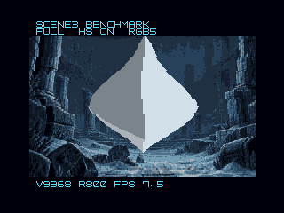
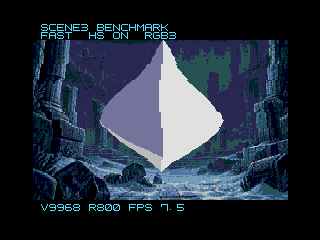

[English](README.md)

# SCENE3 BENCHMARK

海底遺跡、動く立体、水の揺らぎを、V9968 と従来の VDP で比較する独立したデモです。既存の5シーンのデモとは別に起動します。同じ1 MiB ROM を ASCII16 として使用します。

## 起動

リポジトリ直下の対応する setup BAT を実行してから、次の BAT を開いてください。通常の起動に z88dk は不要です。

| 環境 | V9968 | 通常 V9958 |
|---|---|---|
| C-BIOS / Z80 | [launch-cbios-v9968.bat](../../tools/benchmark/launch-cbios-v9968.bat) | [launch-cbios-standard.bat](../../tools/benchmark/launch-cbios-standard.bat) |
| FS-A1GT / R800 | [launch-fsa1gt-v9968.bat](../../tools/benchmark/launch-fsa1gt-v9968.bat) | [launch-fsa1gt-standard.bat](../../tools/benchmark/launch-fsa1gt-standard.bat) |

FS-A1GT はセットアップ済み環境にあるユーザー所有の BIOS を使用します。比較用設定は runtime 配下の user-scene3-benchmark に分離し、通常のデモ設定は変更しません。閉じた状態でこの比較用フォルダを削除すれば設定をリセットできます。

## 操作と比較モード

| キー | 操作 |
|---|---|
| F | V9968 上で FULL → FAST → COMPAT → FULL の順に切り替え |
| P | 立体と水の位相を固定／アニメーション再開。描画・BGM・FPS測定は継続 |
| Esc | 表示と BGM を停止。再開はウィンドウを閉じて再起動 |

| モード | コマンド高速化 | パレット |
|---|---|---|
| FULL | ON | RGB 各5ビット、32,768色から16色 |
| FAST | ON | RGB 各3ビット、512色から16色 |
| COMPAT | OFF | RGB 各3ビット、512色から16色 |

通常 VDP では COMPAT に固定します。画面上部にモード、下部に VDP・CPU・FPS を表示します。切り替え後、約2秒で FPS が更新されます。低速時はキー入力の反映も遅くなるため、少し長めに押してください。

通常パレットは各成分を round(元の値 × 7 / 31) で変換します。画面内の色数は16色のままですが、色味や階調に差が出ます。切り替え中のパレット書き換えでは表示を短時間停止するため、一瞬暗くなる場合があります。

| FULL：拡張パレット | FAST：通常パレット |
|---|---|
|  |  |

## 速度測定

2026-09-10、Windows 10 x64、openMSX 21.0 と派生版 d884c4b で確認しました。同じ ROM、60 Hz、P で固定した同じ姿勢と波の位相、約12秒の区間を使用します。描画を省略せず、HUD・BGM・VSync 待ちを含みます。エミュレーター内の経過時間による測定で、ホスト PC の処理速度によるベンチマークではありません。

| 構成 | C-BIOS / Z80 FPS | FS-A1GT / R800 FPS |
|---|---:|---:|
| V9968 FULL | 6.00 | 7.50 |
| V9968 FAST | 6.00 | 7.50 |
| V9968 COMPAT | 1.94 | 2.07 |
| 通常 V9958 | 1.67 | 1.76 |

FPS = 完了した画面交換回数 × 60 ÷ 経過 VBlank 数。表示は約2秒の集計、上表は約12秒の集計です。端数は実際に完了したフレームの時刻を使います。モード切り替えと P 操作で集計をリセットします。アニメーション中は姿勢ごとの描画量で値が変わります。

V9968 の COMPAT と通常 V9958 の速度は同一ではありません。比較対象にはエミュレーター実装の差も含まれます。実機や全コマンドの性能倍率を保証する値ではありません。固定姿勢で FAST と COMPAT の描画部分が画素単位で一致することを確認しました。実機、V9938、別リビジョンの派生版は未確認です。

[検証結果の詳細（JSON）](results.json) / [技術解説 PPTX（日本語）](technical-notes.ja.pptx) / [技術解説 PDF（日本語）](technical-notes.ja.pdf)

## C ソースと再ビルド

リポジトリ直下で実行します。z88dk のパスは手元の配置に置き換えてください。Python 3 と Pillow も必要です。

```powershell
powershell.exe -NoProfile -ExecutionPolicy Bypass -File demos\scene3-benchmark\build.ps1 -Z88dk "<z88dk のフォルダ>"
```

main.c は SCENE3 のみを描画します。既存デモの v9968.c・mapper.c・platform.c・music.c と事前計算データを共用し、SCENE3_BENCHMARK 定義時だけ通常パレットと従来 VDP の起動処理を追加します。再ビルドは比較 ROM と rom.json を更新します。既存デモの ROM は更新しません。

```powershell
powershell.exe -NoProfile -ExecutionPolicy Bypass -File demos\scene3-benchmark\test.ps1 -Runtime runtime\cbios
powershell.exe -NoProfile -ExecutionPolicy Bypass -File demos\scene3-benchmark\test.ps1 -Runtime runtime\cbios -Standard
```

FS-A1GT は runtime\fsa1gt を指定します。テストは独立した test-output フォルダへ結果と画面を保存します。F・P・Esc をエミュレーターのキーマトリクスへ送信し、モード、R20、描画継続、FPS を確認します。実際のキーボード操作の手動テストとは区別してください。FS-A1GT テストの作業フォルダにはローカル BIOS コピーが含まれるため、公開しないでください。

## 技術と出典

背景・退避・帯転送は HMMM、ポリゴンの走査線は LMMV、左右端補完は LMMM。LRMM は使用しません。4ページを使用するため VRAM は128 KiBが必要です。3D の回転・投影は既存デモの事前計算テーブルを使用します。

- [派生版 VDP.hh](https://github.com/buppu3/openMSX/blob/d884c4b/src/video/VDP.hh)：R20 の HS=0x01、EPAL=0x10。
- [派生版 VDP.cc](https://github.com/buppu3/openMSX/blob/d884c4b/src/video/VDP.cc)：拡張パレットは R/G/B の3バイト、通常パレットは RB/G の2バイト。
- [派生版コマンド処理](https://github.com/buppu3/openMSX/blob/d884c4b/src/video/VDPCmdEngine.cc)：高速モードの処理。
- [openMSX ASCII16](https://github.com/openMSX/openMSX/blob/RELEASE_21_0/src/memory/RomAscii16kB.cc)：使用するバンク切り替え。
- フォントは既存デモと同じ [MSX 8x8 font](../v9968-tech-demo/third-party/fonts/README.ja.md) を使用しています。作者に感謝します。利用条件と出典を同文書に記載しています。

一次資料の確認日：2026-09-10。レジスター値は採用中の派生版向けであり、別実装へそのまま適用しないでください。
