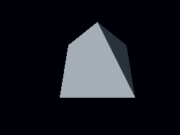

[English](README.md)

# V9968 TECH DEMO

Release ZIP には外付け HRA! V9968 カートリッジ用の `V9968-TECH-DEMO-external-0x88.rom` も同梱しています。openMSX では従来どおり `V9968-TECH-DEMO.rom` を使用します。[プロファイルと実機検証の範囲](DEVELOPMENT.ja.md)を参照してください。

V9968 対応 openMSX で動く、1 MiB ASCII16 ROM の C 製テクニカルデモです。立体、遠近感のある床、水中の揺らぎ、大型パネル、フィードバックの6シーンを約90秒で繰り返します。

リポジトリ直下で対応するセットアップを完了してから、`launch-v9968-tech-demo-fsa1gt.bat`（FS-A1GT / R800）または `launch-v9968-tech-demo-cbios.bat`（C-BIOS / Z80）を実行してください。ROM は `V9968-TECH-DEMO.rom`、フォントは MSX 8x8 font です。通常の起動に z88dk・Python は不要です。


水面GIFと下のラスタは、既定の八面体OBJから生成した現在のデモです。



| キー | 操作 |
|---|---|
| 1〜6 | 対応するシーンを選択 |
| 0 | 自動進行へ戻る |
| W | 水の変形をON/OFF。3のシーンで比較できます |
| Esc | 画面とBGMを停止。再開はウィンドウを閉じて再起動 |

| シーン | 表現 |
|---|---|
| 1 REACTOR | OBJメッシュの回転・投影を事前計算し、VDPが色付き走査線を描画（同梱既定モデルは八面体） |
| 2 FLIGHT DECK | 2ピクセル高の帯ごとにLRMMの倍率・参照位置を変える床と3D軌道 |
| 3 UNDERTOW | 沈んだ海底遺跡と動く立体を描画し、VRAMへ退避して、縦方向の波と最大左右2ピクセルの横揺れを加えて再転送 |
| 4 VORTEX | 細かいグリッドの大型パネルをLRMMで回転・拡大縮小 |
| 5 RESONANCE | 金属球・3D軌道・奥行き順に描く12枚の破片 |
| 6 AFTERGLOW | ヘッダーを出さない画面で開始。保持したページへ立体を白一色で描き、毎フレーム全画面 LMMV（AND）1回でちょうど1段暗くする。明るさを色番号の立っているビット数で定義した無彩色パレットを使うため、残像は均等に黒へ落ちる。さらに保持したページを毎フレーム少しずつ拡大し、消えていく複製を立体の下から外へ出すことで残像を見えるようにする。3秒後にヘッダーが現れ、そのまま再帰フレームバッファフィードバックへ移行する。前フレームの描画結果を VRAM に残し、HMMM で平行移動または LRMM で変形して、現フレームの立体と合成し、次の履歴として取り込む |

3Dの投影、OBJのラスタライズ、立体の走査線、変形パラメーターをROMへ事前計算しています。軌道・破片・水は256段階、共有OBJメッシュと床は128段階です。水は画面の屈折風エフェクトです。横帯ごとに縦方向の参照位置を変えます。振幅4ピクセル・周期64ピクセルで、上下の参照位置をクランプします。横方向には最大左右2ピクセルの揺れを加え、左右端は端の画素を繰り返して隙間を防ぎます。ヘッダーの背後の絵も他と同じように揺れますが、タイトルとシーン番号はその後から重ねて描くため動きません。Scene 3の立体はScene 1と同じ姿勢テーブル・時間基準で動き、毎フレーム描き直した画面に揺れを加えます。

各シーンのヘッダーは、1ドットの黒いドロップシャドウを文字の背後にあらかじめ合成した帯を、完成した画面へ透明転送で1回重ねるだけです。背景が何であっても読めます。

### 3Dメッシュの差し替え

`generate-megarom.py` は形状用の Wavefront OBJ を入力できます。既定は `assets/octahedron.obj` です。Scene 1・Scene 3・Scene 6 は同じ MESH テーブルを共有しているため、OBJ を差し替えると3シーンすべてが同じモデルへ変わります。生成時にモデルを中心合わせ・自動正規化し、ソフトウェア Z-buffer で128姿勢をオフライン描画してフラットシェーディングし、実行時側は従来と同じ1フレーム4096バイトのVDPコマンド形式を読みます。

```powershell
python generate-megarom.py --mesh-obj assets/torus.obj --mesh-radius 74
powershell.exe -NoProfile -ExecutionPolicy Bypass -File build.ps1 -Z88dk "C:\z88dk" -MeshObj "C:\models\model.obj" -MeshRadius 74
```

OBJ は頂点位置と面を使用し、テクスチャ座標・OBJ内の法線・マテリアルは無視します。多角形は扇形に三角形分割するため、凹多角形はOBJ側で三角形化してください。固定長MESHレコードには、縦結合後の矩形を1姿勢あたり最大371個まで格納できます。細かすぎるOBJは次のROM資産を壊すのではなく、該当フレームと必要矩形数を表示して生成を停止します。ポリゴン数を減らすか `--mesh-radius` を小さくすると収まる場合があります。

SCREEN 5の256×192・16色とRGB各5ビットの拡張パレット、HS、LRMMを使用します。水の帯転送はHMMMを使用します。この方式そのものがV9968専用という意味ではなく、コマンド高速化を利用しています。

現在のソースツリーは固定した `buppu3/openMSX 14215c7` を対象とし、以前の d884c4b での測定値は当時の記録として保持しています。[エミュレーター更新記録](../../docs/emulator-update-20260924.ja.md)を参照してください。起動 BAT は `-romtype ASCII16` を指定します。ROM だけを開く場合も同じ種類を指定してください。バンク番号はすべて 256 未満なので、同じ ROM は ASCII16-X 対応ハードでもそのまま動作します。実機や別のエミュレーターでの確認は未実施です。

PSG 3声のオリジナル BGM を収録しています。以前のビルドの速度測定値は 0.7.2 の実測値として扱いません。


## 謝辞

V9968 TECH DEMO のタイトルとシーン番号には、1re1 さんの **MSX 8x8 font** を使用しています。素晴らしいフォントを公開してくださった作者に感謝します。[出典・利用条件・変換方法](third-party/fonts/README.ja.md)。

ビルド・事前計算・VRAM配置・検証結果は[開発・検証](DEVELOPMENT.ja.md)を参照してください。

Scene3は画素を維持し、VDP転送とコマンド設定の負担を削減しました。[最適化の測定結果](../scene3-benchmark/OPTIMIZATION.ja.md)。

## OBJ互換性と既定形状

ビルド時にWavefront OBJを入力できます。既定は元の八面体形状（`assets/octahedron.obj`）で、`assets/torus.obj` は選択用の例です。`-MeshObj` / `--mesh-obj` による外部ファイル指定も維持しています。Scene 1・3・6は同じメッシュを共有し、実行時にOBJを解析しません。

既定形状は0.7.1と画素単位では一致しません。既定半径は88とし、元の八面体の頂点の大きさを維持します。任意選択のトーラスには半径74を明示してください。また、整数丸めした多角形描画と面番号による周期的な陰影（色8〜12）から、小数座標の投影・画素中心のZバッファ描画・面法線による両面の陰影（色8/10/12）へ変わっています。全128姿勢で差があります。回転の進行、カメラ式、実行時の効果は変更していません。凹多角形は扇形分割で一般には正しく扱えないため、入力前に三角形化してください。マテリアルと入力法線は使用しません。

同梱ベンチマークROMとFPS・PDF記録は0.7.1の履歴資料として保持しています。再ビルド品は現在のOBJの描画負荷になるため、過去の測定値をそのROMへ付け替えないでください。[OBJのビルド・検証結果](obj-verification.json)。

トーラス例は1姿勢で最大356矩形を使い、上限371まで残り15矩形です。細部や半径を増やすと容量を超える場合があります。相対OBJパスは実行時のカレントディレクトリを先に確認し、見つからない場合はデモのディレクトリから解決します。外部ファイルを確実に選ぶには絶対パスを指定してください。`-MeshRadius` の省略時は生成器の既定値（88）を使い、明示指定時はその値を使います。OBJのバックスラッシュによる継続行に対応し、非有限の頂点座標は行番号付きで拒否します。
