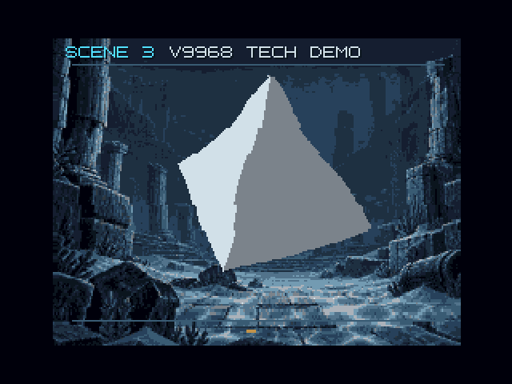

[日本語](README.ja.md)

# V9968 TECH DEMO

A C technical demo for V9968-enabled openMSX, supplied as a 1 MiB ASCII16 ROM. Five scenes show a solid, perspective-style floor, underwater distortion and large panels, repeating in roughly 75 seconds.

After completing the corresponding setup at the repository root, run `launch-v9968-tech-demo-fsa1gt.bat` (FS-A1GT / R800) or `launch-v9968-tech-demo-cbios.bat` (C-BIOS / Z80). The ROM is `V9968-TECH-DEMO.rom`, using MSX 8x8 font. Normal launch requires neither z88dk nor Python.

| Key | Action |
|---|---|
| 1–5 | Select a scene |
| 0 | Return to automatic playback |
| W | Toggle water distortion; compare it in scene 3 |
| Esc | Stop picture and music; close and relaunch to replay |

| Scene | Presentation |
|---|---|
| 1 REACTOR | Precomputed shaded octahedron rotation/projection, rendered as VDP spans |
| 2 FLIGHT DECK | LRMM source/scale changes per two-pixel strip, with 3D orbits |
| 3 UNDERTOW | Render submerged ruins and an animated solid, capture to VRAM and resample with vertical waves and gentle horizontal motion of up to two pixels each way |
| 4 VORTEX | LRMM rotation and zoom of a detailed large grid panel |
| 5 RESONANCE | Metallic sphere, 3D orbits and 12 depth-ordered fragments |

Projection, draw order, solid scanlines and deformation parameters are precomputed into ROM. Orbits, fragments and water have 256 steps; the solid and floor have 128. Water is a screen-refraction effect that vertically resamples horizontal strips, with a four-pixel amplitude and 64-pixel spatial period. Vertical source positions are clamped; horizontal motion is limited to two pixels each way, with outermost pixels repeated to fill the edges. The title and scene number stay stationary. Scene 3 animates the solid with the same pose table and clock as Scene 1, applying distortion to a freshly rendered image each frame.

Rendering uses SCREEN 5 at 256×192 with 16 colors, five-bit RGB components, HS and LRMM. Water strip transfers use HMMM: the technique is not exclusive to V9968, but benefits from its accelerated commands.

The target is pinned `buppu3/openMSX d884c4b`. The launcher specifies `-romtype ASCII16`; select that type when opening the ROM separately. All bank numbers stay below 256, so the same ROM also runs unchanged on ASCII16-X hardware. Physical hardware and other emulators remain untested.

The original three-voice PSG score is included. Timing results for earlier builds are not performance measurements of 0.6.0.

See [development and verification](DEVELOPMENT.md) for builds, precomputation, VRAM layout and results.

## Acknowledgments

V9968 TECH DEMO uses **MSX 8x8 font** by **1re1** for its title and scene labels. Thank you to the author for making this font available. See [sources, terms and conversion](third-party/fonts/README.md).
