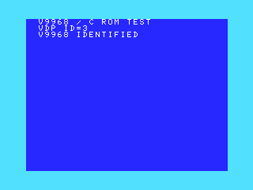

日本語 | [English](setup.md)

# セットアップと構成

[トップ](../README.ja.md)

## ダウンロード

[GitHub Releases](https://github.com/renatus-xxxx/openmsx-v9968-windows-setup/releases) の **Assets** から配布 ZIP を取得し、全体を新しい書込み可能なフォルダへ展開してください。以降の BAT は展開先から実行します。**Source code** のアーカイブは選択しません。

## C-BIOS

`setup-cbios-v9968.bat` を実行します。公式 openMSX 21.0 Windows x64 ZIP と V9968 派生版 **d884c4b** を取得し、実行前に ZIP のサイズ・SHA-256 と実行ファイルの SHA-256 を検査します。C-BIOS **0.29** は公式 ZIP に同梱されています。通信量は合計約18 MB、導入先は1環境あたり約200 MBの余裕を見込み、失敗時の保管分は別途必要です。

C-BIOS_MSX2+_JP を基に、内蔵 V9968・日本語・60 Hz の構成を作成します。カートリッジイメージ用で、BASIC・ディスク環境は提供しません。

## FS-A1GT

対応 ROM の入ったフォルダを `setup-fsa1gt-v9968.bat` へドラッグします。引数なしのダブルクリックではフォルダ選択が開きます。コマンドプロンプトからは次のように指定できます。

```bat
setup-fsa1gt-v9968.bat "D:\MSX BIOS\FS-A1GT"
```

必要なのは `fs-a1gt_firmware.rom`（4,194,304 bytes）と `fs-a1gt_kanjifont.rom`（262,144 bytes）です。別名もサイズと [versions.json](../config/versions.json) の SHA-1 で識別します。サブフォルダも検索しますが、リンク先のディレクトリは追跡しません。同じ内容の重複は1つを採用し、対応する異なるバージョンが同時にある場合は停止します。分割ファイルは先に[結合](bios-dump.ja.md)します。

公式 FS-A1GT 機種の CPU・512 KiB RAM・ディスク等は保持し、内蔵 VDP を V9968、I/O 98h～9Ch、timing=0 に置き換えます。標準実機ではない実験構成です。FS-A1GT の元の VDP は V9958 です。外付け V9968 カートリッジ構成は含めません。派生版は XML の vram サイズを無視するため、vram=128 を V9968 の実容量と解釈しないでください。

## 配置

```text
直下: セットアップ／起動の4つの BAT
tools/verify/    自動確認・通常版比較
tools/bios/      BIOS 結合・BASIC 起動
tools/dev/       C ビルド
scripts/         実装とランチャーのテンプレート
probe/           C ソースと確認アプリ
config/          固定バージョンと参考機種 XML
licenses/        第三者の原文ライセンス
docs/           日英の説明と画像
tests/          配布・リンク検査
runtime/cbios/   実行後に作る C-BIOS 環境（非公開）
runtime/fsa1gt/  実行後に作る FS-A1GT 環境（BIOS 入り・非公開）
cache/           検証済みダウンロード ZIP（非公開）
private/         ローカルで結合した BIOS（非公開）
build/          開発用ビルド生成物（Git 管理対象外）
```

直下の起動 BAT はこの標準配置を参照します。各環境には user-v9968、user-standard、user-selftest を分けて作成します。本体、ROM のコピー、config.json、installation.json、ログは環境内に保持し、直下の BAT が内部ランチャーを呼び出します。

新規の作業用フォルダで構築し、C テストの ID=3 が確認できた場合だけ完成先へ移します。中断・失敗したフォルダや不完全ダウンロードは調査用に残します。再実行では管理ファイルを検査し、ユーザー設定を保持してキャッシュを再利用します。管理対象の変更があれば停止します。再利用時は起動テストを繰り返さないので、必要に応じてtools/verify の確認 BAT を実行してください。

ハッシュの出典は versions.json にあります。公式 ZIP は GitHub リリース API の digest と一致し、派生版はローカル測定値です。不一致は無視せず、最新バージョンへ自動追従しません。

BAT は Windows PowerShell の標準モジュールを選択します。実行ポリシーの一時指定・環境変数はプロセス内だけで、グローバル PATH・レジストリを変更しません。管理者権限で依存ソフトを追加導入する処理もありません。一部の詳細なコンソール表示は日本語です。英語版の説明書と[トラブル対処](troubleshooting.ja.md)にも対応する条件を記載しています。

## 確認画面と制限

V9968 構成では **VDP ID=3 / V9968 IDENTIFIED**、通常版比較では **ID=2** が期待値です。識別成功は全描画機能、ゲーム、FPS、音声・周辺機器、R800 の動作を保証しません。確認用カートリッジは Z80 で実行します。



